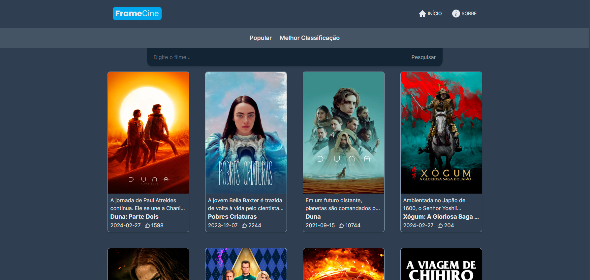
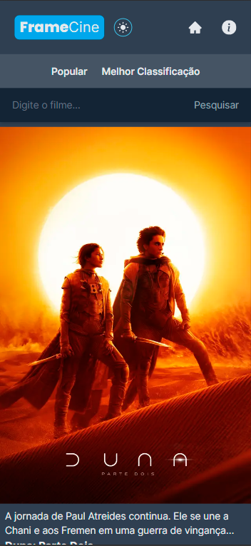

# Frame Cinema


## Overview

Web development project in which the idea was to create an app that displays data from any searched film. The fully responsive website has a theme switch button, category filters and a search bar.

In this project I used the free TMDB API (https://www.themoviedb.org/)

Still in the development process...

[View Project](https://frame-cinema.vercel.app/)

## :man_mechanic: Languages and Tools

- Next JS
- Tailwind CSS
- Git

## :paintbrush: Layout

### :desktop_computer: Desktop



### :iphone: Mobile



## :computer: Dependencies

```shell
# 1. Clone the project

git clone https://github.com/dev-andreola/frame-cinema.git

# 2. Install dependencies

npm install

# 3. Run live server

npm run dev
```

## :triangular_flag_on_post: Contribute to the project

The content **may contain some errors** as I am a student and the repository is constantly evolving.

If you have any corrections or improvements that would make this better, please fork the repo and create a pull request.

1. Fork the Project
2. Create your Feature Branch (`git checkout -b feature/Feature`)
3. Commit your Changes (`git commit -m 'Add some Feature'`)
4. Push to the Branch (`git push origin feature/Feature`)
5. Open a Pull Request
